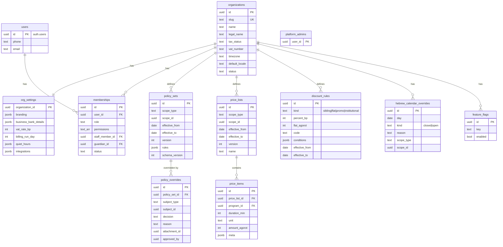
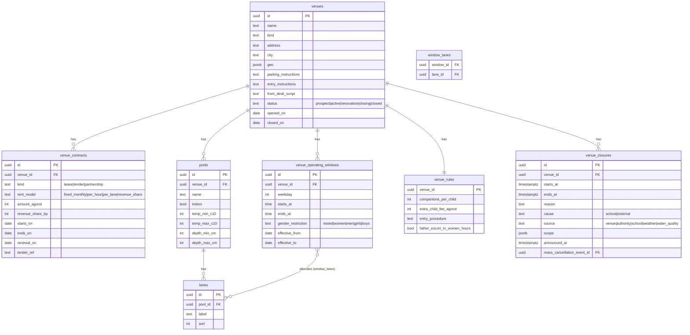
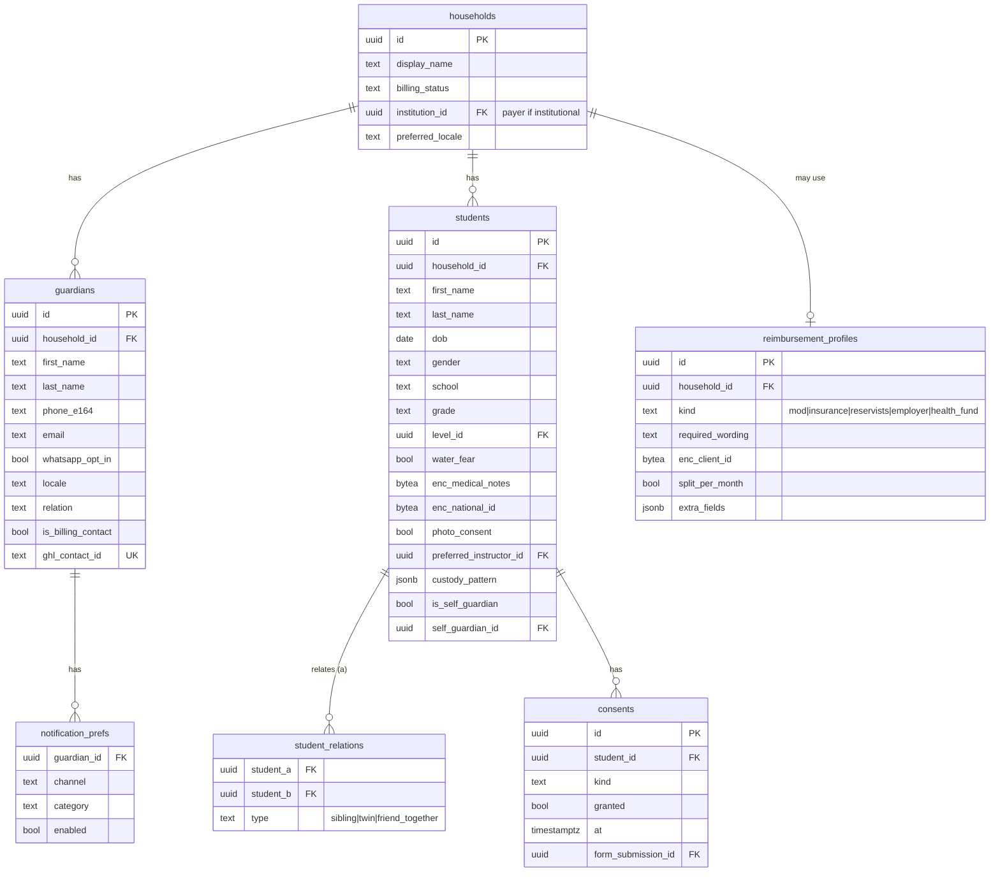
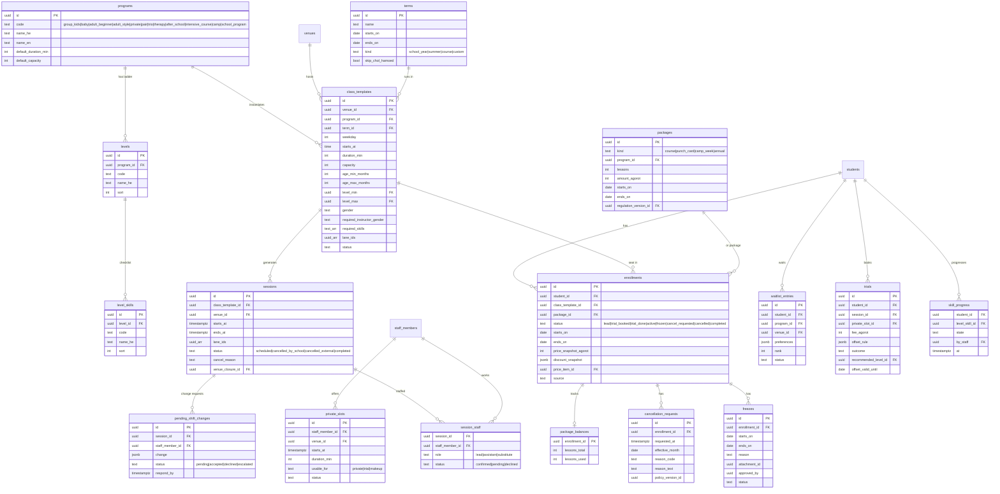
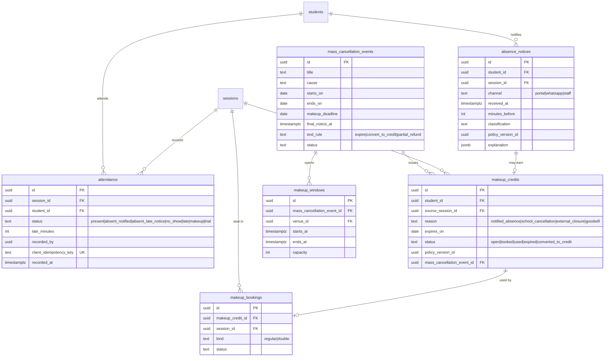
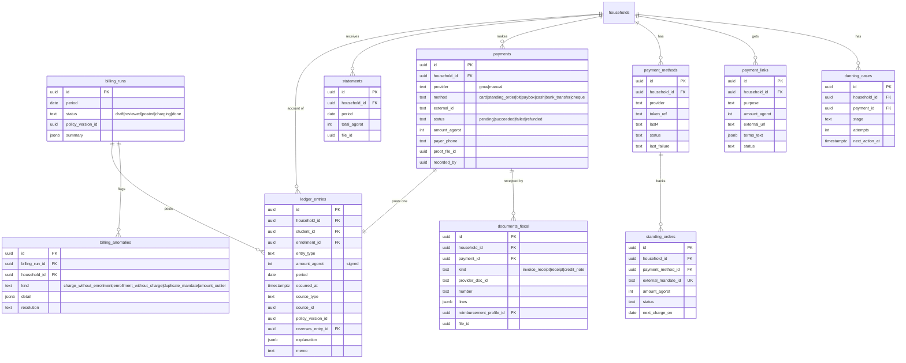
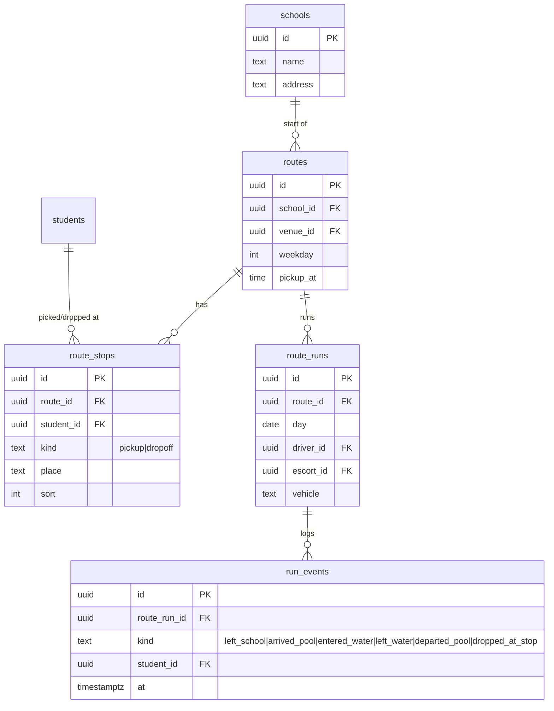
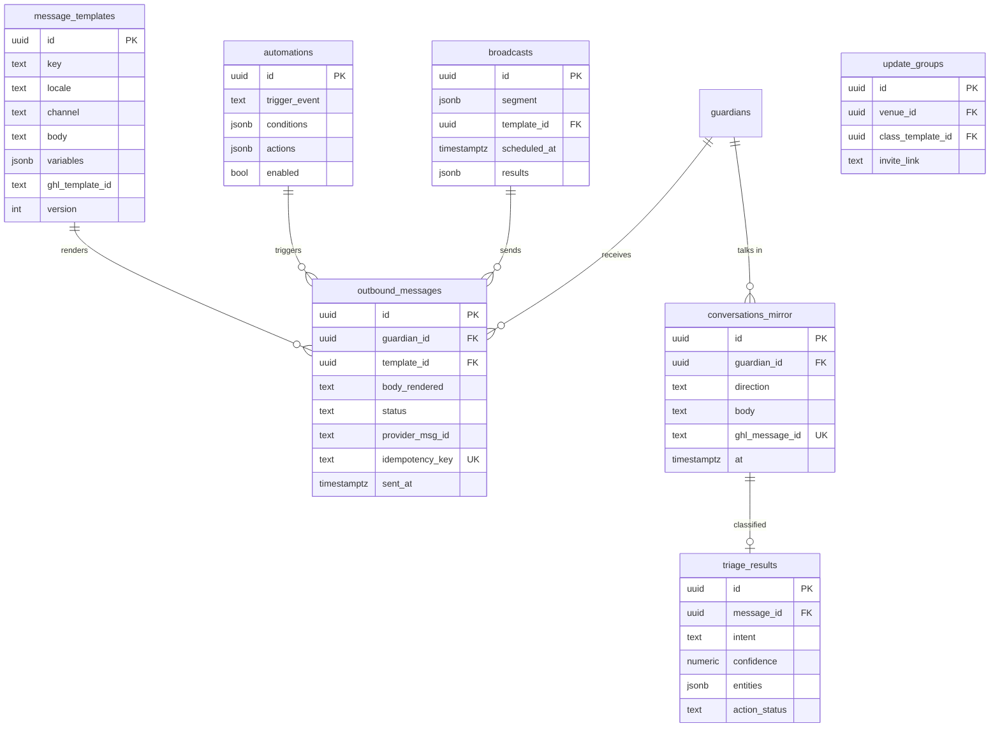

# ERD — R-SWIM OS (draft v0.1)

Conventions for every table below unless stated:
- `id uuid pk`, `organization_id uuid not null` (FK → organizations, part of composite FKs), `created_at`, `updated_at`, `created_by`.
- Money columns end in `_agorot` (int). Dates in `Asia/Jerusalem` local `date`; instants `timestamptz`.
- `enc_` prefix = application-encrypted `bytea` (see ADR-0005).
- Versioned config tables carry `effective_from date`, `effective_to date null`, `version int`.

`organization_id` is omitted from the diagrams to keep them readable. Diagrams are split by module; FK names link across diagrams.

## 1. Tenancy, identity, settings

## 2. Venues

## 3. People

## 4. Staff, payroll, recruitment

```mermaid
erDiagram
  staff_members ||--o{ certifications : holds
  staff_members ||--o{ staff_skills : has
  staff_members ||--o{ availability_rules : has
  staff_members ||--o{ availability_exceptions : has
  staff_members ||--o{ pay_rules : "paid by"
  staff_members ||--o| pension_eligibility : tracks
  staff_members ||--o{ sick_leave_accruals : accrues
  staff_members ||--o{ staff_documents : has
  staff_members ||--o{ timesheets : submits
  timesheets ||--o{ timesheet_lines : contains
  payroll_runs ||--o{ payroll_lines : produces
  staff_members ||--o{ payroll_lines : receives
  applicants }o--o| job_posts : "applied to"
  staff_members ||--o{ cash_handovers : records

  staff_members {
    uuid id PK
    text first_name
    text last_name
    text phone_e164
    text gender
    text employment_type "employee|freelancer_exempt|freelancer_licensed|hybrid"
    date start_date
    date end_date
    bytea enc_national_id
    bytea enc_bank_details
    text status
  }
  certifications {
    uuid id PK
    uuid staff_member_id FK
    text type "swim_instructor|lifeguard|hydrotherapy|baby_swim|first_aid"
    text issuer
    date expires_on
    uuid file_id
  }
  staff_skills {
    uuid staff_member_id FK
    text skill "babies|water_fear|therapy|adults|advanced"
  }
  availability_rules {
    uuid id PK
    uuid staff_member_id FK
    int weekday
    time starts_at
    time ends_at
    uuid venue_id FK
    date effective_from
    date effective_to
  }
  availability_exceptions {
    uuid id PK
    uuid staff_member_id FK
    timestamptz starts_at
    timestamptz ends_at
    text kind "unavailable|extra"
    text reason
  }
  pay_rules {
    uuid id PK
    uuid staff_member_id FK
    text basis "per_hour|per_session_type|per_head|flat_per_lesson"
    text session_type
    uuid venue_id FK
    int amount_agorot
    int travel_agorot
    text routing "payslip|transfer"
    date effective_from
    date effective_to
    int version
  }
  pension_eligibility {
    uuid staff_member_id PK
    date continuous_since
    int threshold_months
    date eligible_from
    bool retro_applied
  }
  sick_leave_accruals {
    uuid id PK
    uuid staff_member_id FK
    date period
    int accrued_halfdays
    int used_halfdays
  }
  staff_documents {
    uuid id PK
    uuid staff_member_id FK
    text kind "payslip|form_101|form_100|contract"
    date period
    uuid file_id
  }
  timesheets {
    uuid id PK
    uuid staff_member_id FK
    date period
    text status "draft|confirmed|disputed|approved"
    timestamptz confirmed_at
  }
  timesheet_lines {
    uuid id PK
    uuid timesheet_id FK
    uuid session_id FK
    text source "auto|manual"
    int minutes
    text note
  }
  payroll_runs {
    uuid id PK
    date period
    text status
    uuid policy_version_id
  }
  payroll_lines {
    uuid id PK
    uuid payroll_run_id FK
    uuid staff_member_id FK
    text routing
    text kind
    int amount_agorot
    jsonb explanation
  }
  cash_handovers {
    uuid id PK
    uuid staff_member_id FK
    int amount_agorot
    timestamptz at
    uuid received_by
  }
  job_posts {
    uuid id PK
    uuid venue_id FK
    text title
    text body_he
    jsonb slots
    text status
  }
  applicants {
    uuid id PK
    uuid job_post_id FK
    text name
    text phone_e164
    text source
    text stage
    int rate_ask_agorot
    jsonb availability
    jsonb scorecard
  }
```

## 5. Programs, scheduling, enrollment

## 6. Attendance & makeups

## 7. Money

`debts` and `household_balances` are views over `ledger_entries`.

## 8. Transport (after-school)

`escort_pay_rules` reuse `pay_rules` with `session_type = escort_run`.

## 9. Communications

## 10. Ops, compliance, institutions, platform plumbing

```mermaid
erDiagram
  forms ||--o{ form_submissions : collects
  regulation_versions ||--o{ form_submissions : "accepted in"
  institutions ||--o{ institution_contracts : signs
  institutions ||--o{ households : pays_for

  tasks {
    uuid id PK
    uuid assignee_id
    date due_on
    text subject_type
    uuid subject_id
    text status
  }
  incidents {
    uuid id PK
    uuid venue_id FK
    uuid session_id FK
    text kind
    text description
    text severity
  }
  inventory_items {
    uuid id PK
    uuid venue_id FK
    text name
    int qty
  }
  forms {
    uuid id PK
    text kind "registration|health_declaration|insurance|photo_consent|regulations"
    jsonb schema
    int version
  }
  form_submissions {
    uuid id PK
    uuid form_id FK
    uuid regulation_version_id FK
    uuid guardian_id FK
    uuid student_id FK
    jsonb answers
    timestamptz signed_at
    text signed_phone
    inet ip
  }
  regulation_versions {
    uuid id PK
    text scope
    text body_he
    int version
    date effective_from
  }
  institutions {
    uuid id PK
    text type
    text name
    text contact
  }
  institution_contracts {
    uuid id PK
    uuid institution_id FK
    jsonb terms
    date starts_on
    date ends_on
  }
  audit_log {
    bigint id PK
    uuid actor_id
    text action
    text subject_type
    uuid subject_id
    jsonb diff
    inet ip
    timestamptz at
  }
  outbox {
    uuid id PK
    text event_type
    jsonb payload
    text idempotency_key UK
    timestamptz dispatched_at
    int attempts
    text last_error
  }
  inbox_receipts {
    text consumer PK
    uuid event_id PK
    timestamptz at
  }
  webhook_events {
    uuid id PK
    text provider
    text external_id
    jsonb raw
    text status
  }
  dead_letters {
    uuid id PK
    text source
    jsonb payload
    text error
    timestamptz at
  }
  files {
    uuid id PK
    text bucket
    text path
    text mime
    text purpose
  }
```

## Platform (Phase 10)
Not tenant data, but RLS is on: `plans` (read by everyone), `platform_admins`, and `templates` (published ones are
read by everyone, a school sees its own submissions). Per school: `org_subscriptions` (one row, keyed by the school),
`platform_invoices` (unique per school and month), `org_domains` (host unique across the platform) and
`template_installs`. Branding lives in `org_settings.branding`.

## Key integrity rules
- `attendance (session_id, student_id)` unique.
- `makeup_bookings`: seat count per session ≤ capacity, enforced with `SELECT … FOR UPDATE` on the session row in the booking service.
- `standing_orders`: partial unique index on `(household_id) where status = 'active'` to stop duplicate mandates; anomaly report also checks provider side.
- `ledger_entries`: trigger blocks UPDATE/DELETE.
- `session_staff`: exclusion constraint on staff × time range (no double-booking); `sessions` × lanes exclusion via `lane_bookings` helper table.
- All FKs between tenant tables are composite `(organization_id, id)`.
